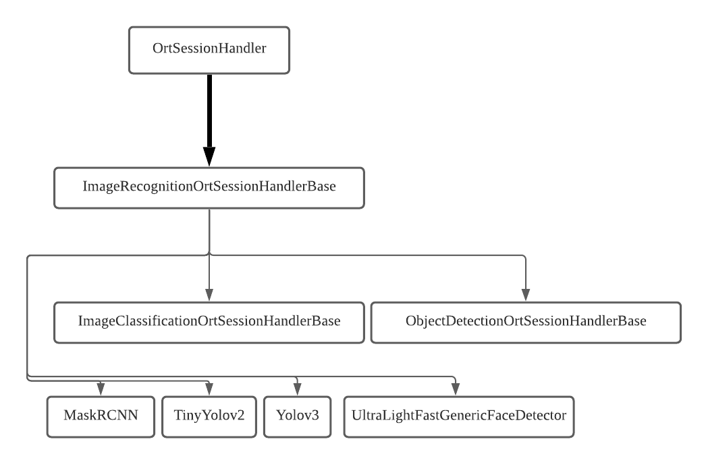

.. onnx_runtime_cpp documentation master file, created by
   sphinx-quickstart on Sat Jul 31 11:48:51 2021.
   You can adapt this file completely to your liking, but it should at least
   contain the root `toctree` directive.

Welcome to onnx_runtime_cpp's documentation!
============================================

**onnx_runtime_cpp** is a small library that contains CPP-based example codes that shows how `onnxruntime <https://www.onnxruntime.ai/>`_ can be applied to your project.

.. toctree::
   :maxdepth: 2
   :caption: Contents:

Indices and tables
==================

* :ref:`genindex`
* :ref:`modindex`
* :ref:`search`

Table of Contents
^^^^^^^^^^^^^^^^^

.. toctree::
    :maxdepth: 2

    api/index
