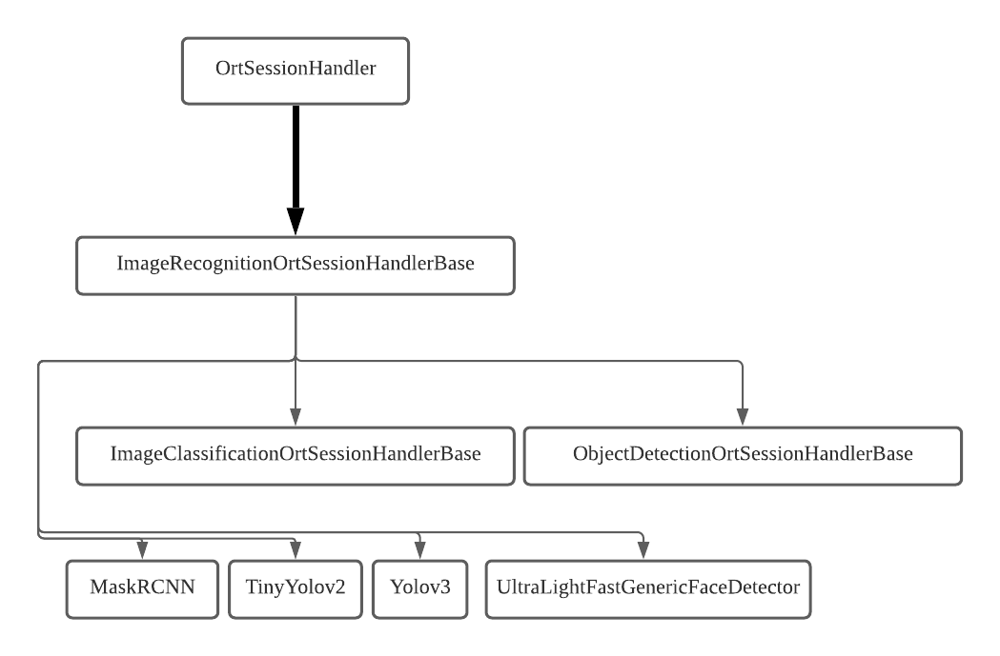

.. _api:

Codebase Architecture
=====================

The illustration below shows the inheritance hierachy within the codebase. In other words, from this diagram, you can get a clear sense which modules depend on what.

